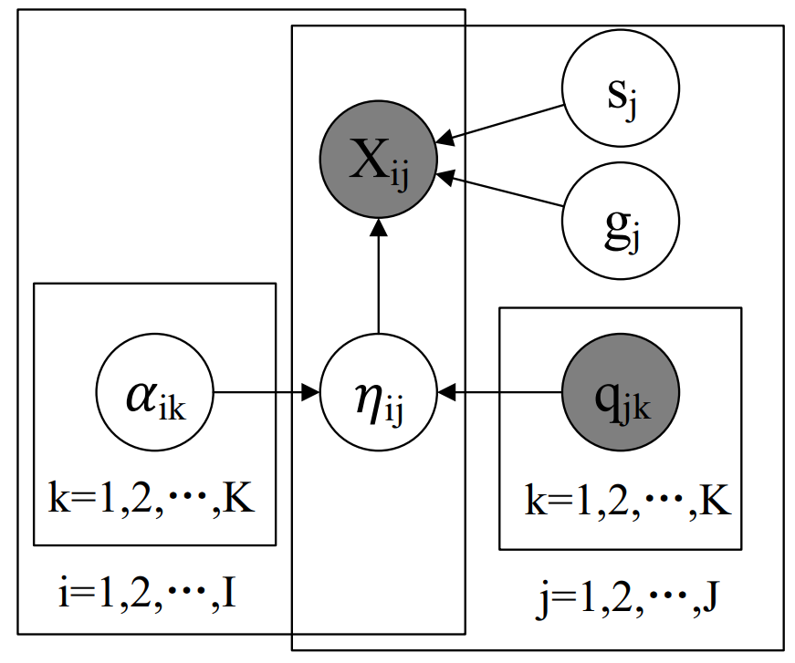

# Deterministic Inputs, Noisy “And” gate model

If the reader wants to know the details of DINA, please refer to the Appendix of the paper: *[DINA model and parameter estimation: A didactic](https://journals.sagepub.com/doi/10.3102/1076998607309474)*.
```bibtex
@article{de2009dina,
  title={DINA model and parameter estimation: A didactic},
  author={De La Torre, Jimmy},
  journal={Journal of educational and behavioral statistics},
  volume={34},
  number={1},
  pages={115--130},
  year={2009},
  publisher={Sage Publications Sage CA: Los Angeles, CA}
}
```


