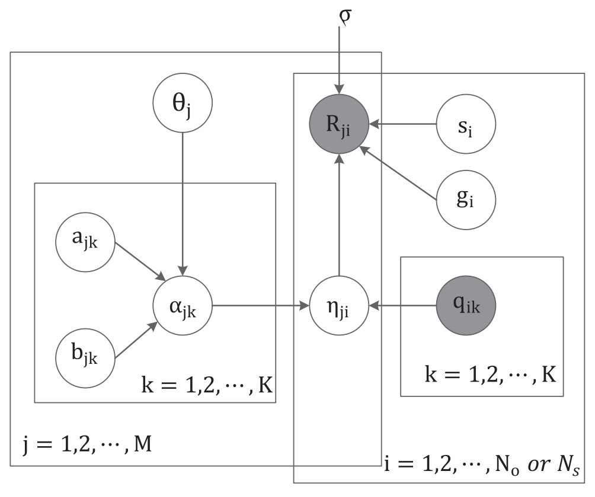

# Fuzzy cognitive diagnosis framework

If the reader wants to know the details of FuzzyCDF, please refer to the Chapter 4 of the paper: *[Fuzzy Cognitive Diagnosis for Modelling Examinee Performance](http://staff.ustc.edu.cn/~qiliuql/files/Publications/Qi-Liu-TIST2018.pdf)*.
```bibtex
@article{liu2018fuzzy,
  title={Fuzzy cognitive diagnosis for modelling examinee performance},
  author={Liu, Qi and Wu, Runze and Chen, Enhong and Xu, Guandong and Su, Yu and Chen, Zhigang and Hu, Guoping},
  journal={ACM Transactions on Intelligent Systems and Technology (TIST)},
  volume={9},
  number={4},
  pages={1--26},
  year={2018},
  publisher={ACM New York, NY, USA}
}
```


